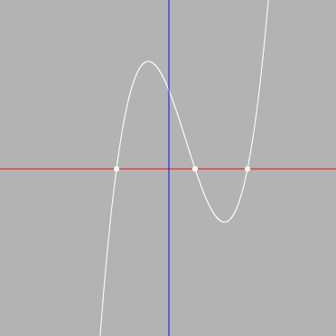

## newtonCubicEquation

三次方程式を解きます。可視化もします

## 出来ること

- 主要機能
  - 三次方程式の各係数とニュートン法の近似開始値を指定して、解を算出する
  - ニュートン法で得られた近似解以外の解(虚数解含む)を算出する
- 可視化関連の機能
  - 与えられた三次関数のグラフを描画
  - 実数解をプロット
  - グラフのズームの調整
- (おまけ) 手っ取り早く試せるよう、サンプルの関数を5つプリセット

## 描画

CreateJS を使用しています。

## 判別式の引用元

http://www2.odn.ne.jp/~aai55890/donnwa2/sanzihannbetu.htm

こちらのサイトで勉強させていただきました。ありがとうございます。
